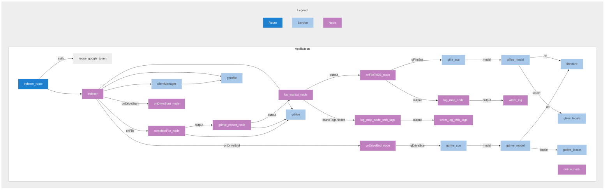

# Drive indexer

## Overview

DESCRIBE YOU APP HERE

## API

GENERATE swagger file and add it in your application under /application/MY APP/documentation.
(use ChatGPT for now, for bootstraping it or swaggerautogen. Soon to be provided by nxn cli... )

cf. [swagger file](/applications/drive_indexer/documentation/indexer.swagger.yml)

## Install

UPDATE BELOW:

```shell
mkdir drive_indexer
cd drive_indexer
git clone https://github.com/PresenceSoft/gdrives_indexer.git .
git submodule update --init --recursive
npm install
```

Create a .firestore file in /client_data/default and copy google credential of service account. In Cloud run, mount the file as a secret.

Then :

```shell
npm run start
```

## Create docker image

### build
```shell
npm run docker
```

### run
```shell
npm run docker:run
```

### deploy
```shell
npm run docker:login
npm run docker:push
```

## Run the scan
To use the service, you need an oAuth token, to be provided via API Endpoint:


## Application Components

This application is based on @nxn framework with a structure :
- services : provider services used by routes and tests
- routes : API endpoints
- nodes : message based services that receive/process and send messages to other nodes. Nodes are useful for creating processing flows (similar to n8n / low code nodes).
- middleware: express middleware components that are used in application (CORS, log, etc.)

### Here is a dependency view of components:


## Services Components

DESCRIBE HERE YOUR COMPONENTS


### Dependency Overview

NB. this mermaid preview can be seen when opening the README in github.

GENERATE YOUR MERMAID Graph and copy/paste it here...

```shell
nxg mermaid
```



MODIFY LINK BELOW

Latest version is available here : [mermaid doc](/client_data/default/config_default.README.mmd). 
You need to install mermaid extension to display overview.

NB. mermaid diagramm is generated from the application YAML config, by running nxn cli command:

```shell
nxg mermaid
```

### Notes
